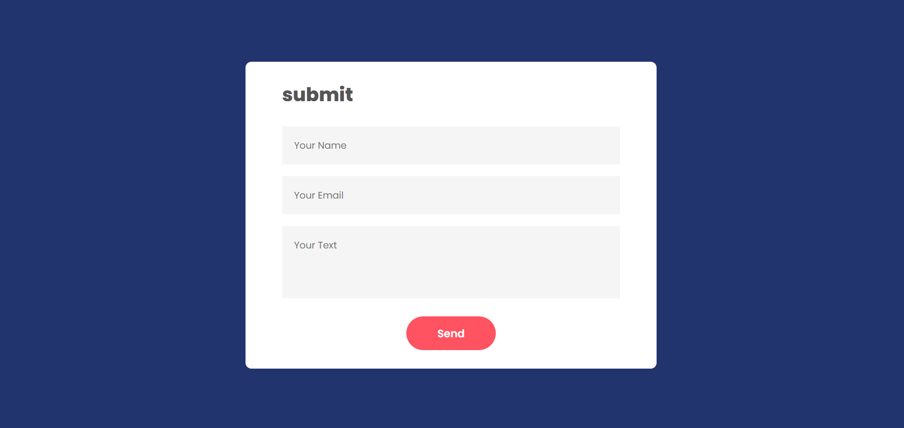

# Email-app
# 📬 React EmailJS Contact Form

A simple React app that allows users to send emails using [EmailJS](https://www.emailjs.com/) without needing a backend server. Users can submit their name, email, and message — and the email is sent directly via a pre-configured EmailJS service.

## ✨ Features

- ✅ Send emails without a backend using EmailJS
- 🧾 Collect user name, email, and message
- 🔐 Uses environment variables to secure EmailJS keys
- 🔁 Reset form after successful submission
- 🔔 Alerts on success or failure

## 📸 Screenshot

